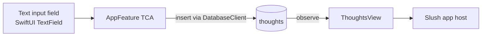
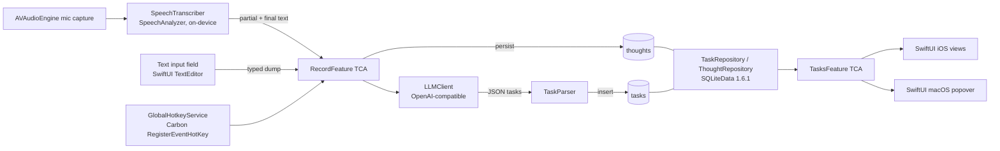

# Slush — Architecture (MVP)

> Living document. Captures the shape of the MVP; details will harden as code lands.

## Current implemented slice



The first product slice implements `US-008`: typed thought capture with local persistence. It does
not perform transcription, LLM extraction, or task creation yet. A submitted text dump becomes a
`Thought` row in the `thoughts` table and renders back through SQLiteData observation.

## Planned MVP component diagram



## UX implications (load-bearing)
Slush is UX-driven (see PRD `Product principles`, `REQ-031`). The architecture below isn't just convenient — these choices exist specifically to keep the app feeling instant and out of the way. Treat them as requirements, not preferences.

- **Live partials stream into `RecordFeature.state.partialText`** so the user sees their words within hundreds of ms — product requirement, not a nicety (`REQ-031`).
- **`AVAudioEngine` starts synchronously on the user gesture.** Permission prompts are gated to first launch only, so the steady-state press → mic-active path is allocation-light (`REQ-031`).
- **LLM call is fire-and-forget from the user's perspective.** The thought is persisted immediately; extraction runs in a background effect; `TasksFeature` re-renders via `@FetchAll` when rows land. The user is never staring at a spinner that owns the UI thread (`REQ-031`, `REQ-033`).
- **macOS hotkey path skips popover presentation.** Showing a popover would pay window-server latency on every capture; the hotkey starts recording without surfacing UI (`REQ-031`).
- **All repository, transcription, and LLM work is non-main-actor.** The main actor only formats view state and runs animations. 60 fps during recording is a hard target (`REQ-031`).
- **Typed input starts as local thought capture (`US-008`, `REQ-025`).** No mic, no transcription, no permissions; the implemented slice writes `Thought` rows immediately and observes them with `@FetchAll`. LLM extraction and task rendering are deferred until `US-003`, but the UI must still stay responsive and avoid main-actor I/O.

## Concurrency & module posture

Load-bearing settings — every Xcode target and Swift package must mirror these. Changing any of them is a deliberate architectural decision, not a tweak.

- **Repo layout.** `App/` is the thin Xcode host: `App/Slush.xcodeproj` owns build settings, signing, platform app targets, resources, entitlements, plist files, and `App/Tests.xctestplan`. Reusable product code, app-shell modules, feature modules, and their tests grow inside the single `SlushKit/Package.swift` package as separate SPM targets. Do not create separate package directories until the one-package target model becomes a concrete problem.
- **Swift 6 language mode** project-wide. The Xcode 26 compiler is *version* 6.2 but its language mode is `6` — there is no Swift 6.2 *language mode*. Set `SWIFT_VERSION = 6.0` at the Xcode project level (not per target) and `swiftLanguageModes: [.v6]` plus `// swift-tools-version: 6.0` in every `Package.swift`.
- **Approachable Concurrency on.** Xcode: `SWIFT_APPROACHABLE_CONCURRENCY = YES` at the project level. SPM: enumerate the upcoming features in `swiftSettings`:
  - `.enableUpcomingFeature("NonisolatedNonsendingByDefault")` (SE-0461)
  - `.enableUpcomingFeature("InferIsolatedConformances")` (SE-0470)
  - `GlobalActorIsolatedTypesUsability` (SE-0434) is already enabled in Swift 6 mode and must not be re-listed (the compiler warns).
- **`MemberImportVisibility` upcoming feature on** (Xcode `SWIFT_UPCOMING_FEATURE_MEMBER_IMPORT_VISIBILITY = YES`; SPM `.enableUpcomingFeature("MemberImportVisibility")`).
- **No default actor isolation.** `SWIFT_DEFAULT_ACTOR_ISOLATION` stays unset; `Package.swift` does not call `.defaultIsolation(MainActor.self)`. The Composable Architecture's `@Reducer` and `@ObservableState` macros break under default-MainActor isolation, and the TCA maintainer recommends against the setting ([pointfreeco/swift-composable-architecture#3808](https://github.com/pointfreeco/swift-composable-architecture/issues/3808)). The "main actor only formats view state; infra is non-main" requirement (`REQ-031`) is met via TCA conventions: views and `@ObservableState` adopt `@MainActor` explicitly; reducers stay nonisolated; effects, repositories, transcribers, and LLM clients are `actor`s or nonisolated types. Strict concurrency at level `complete` is implicit under Swift 6 — no separate setting needed.
- **Tests stay nonisolated by default.** Add `@MainActor` per `@Test` only when a test must touch main-actor state.

**Canonical `SlushKit/Package.swift` shape for new modules:**

```swift
// swift-tools-version: 6.0
import PackageDescription

let swiftSettings: [SwiftSetting] = [
    .enableUpcomingFeature("MemberImportVisibility"),
    .enableUpcomingFeature("NonisolatedNonsendingByDefault"),
    .enableUpcomingFeature("InferIsolatedConformances"),
]

let package = Package(
    name: "SlushKit",
    platforms: [.iOS("26.4"), .macOS("26.4")],
    products: [
        .library(name: "<Module>", targets: ["<Module>"]),
    ],
    targets: [
        .target(name: "<Module>", swiftSettings: swiftSettings),
        .testTarget(name: "<Module>Tests", dependencies: ["<Module>"], swiftSettings: swiftSettings),
    ],
    swiftLanguageModes: [.v6]
)
```

When adding a module, create `SlushKit/Sources/<Module>` and `SlushKit/Tests/<Module>Tests`, then add the test target to `App/Tests.xctestplan` so the app scheme runs it.

## Module breakdown

### Repo layout (today)
Today the repo intentionally has one app host and one package workspace:

- `App/Slush.xcodeproj` has a single `Slush` app target that supports iOS, iPadOS, and macOS while the product is still early. It links the local `../SlushKit` package directly via `XCLocalSwiftPackageReference`.
- `App/Client` holds the thin app entry point and app resources. It bootstraps SQLiteData and displays the package-owned typed thought capture surface.
- `App/Tests.xctestplan` is the app scheme's test list. Every new `SlushKit` test target must be added here so `xcodebuild -project App/Slush.xcodeproj -scheme Slush ... test` runs the app host and package tests in one command.
- `SlushKit/` is the single Swift package workspace. Current product code is `AppFeature`, which owns typed thought capture, the `Thought` model, SQLite bootstrap, and tests for this first slice. Future modules become additional products and targets in this package, not separate packages by default.

Do not create empty modules or move files just to match the target layout. Add a module when it has code, tests, and a narrower dependency surface than the target it is leaving.

### Target app layout
Future platform folders under `App/` should remain host-only:

- `App/iOS` — iOS app target files such as `SlushiOSApp`, plist/resources, entitlements, and minimal platform bootstrap.
- `App/macOS` — macOS app target files such as `SlushMacApp`, plist/resources, entitlements, `MenuBarExtra` host, hotkey/menu bootstrap, and settings-window declaration.

Product behavior stays in `SlushKit` modules. App targets import package products, bind them to platform entry points, and own platform resources.

### Target package layout
Future reusable code should grow as targets under `SlushKit/Sources/<Module>` with tests under `SlushKit/Tests/<Module>Tests`:

- `SlushDomain` — shared domain models such as `Thought`, `Task`, `TaskDraft`, and `Settings`.
- `PersistenceClient` — task/thought persistence interfaces and implementations shared by multiple features.
- `CaptureFeature` — TCA capture, transcription, extraction, and retry behavior. `SpeechClient` and `LLMClient` stay here while capture is their only consumer.
- `TasksFeature` — task list state, task actions, completion, deletion, and task observation behavior.
- `SettingsFeature` — settings state, validation, persistence, API-key handling, and settings-specific dependencies.
- `SlushiOSApp` — shared iOS app shell behavior and root composition, imported by the iOS app target.
- `SlushMacApp` — shared macOS app shell behavior, menu-bar/window composition, and hotkey routing, imported by the macOS app target.

Avoid a generic `SlushDependencies` package unless a concrete duplication or multi-consumer dependency appears. Prefer narrow dependencies owned by the feature that actually uses them.

### TCA ownership rules
- Features are behavior-owned, not screen-owned. Split a feature when behavior diverges, not because two platforms render it differently.
- Platform views take `StoreOf<Feature>` from app-shell modules and send user-intent actions into shared features.
- App shell features own tabs, popovers, windows, hotkey routing, and platform navigation; child features own product behavior.
- Scope stores along stored child feature state. Do not scope through computed view-specific projections.

### `SlushiOS` — iPhone app target
- Thin platform host under `App/iOS`; imports the `SlushiOSApp` package product and declares resources, plist, entitlements, and signing.
- The `SlushiOSApp` package module owns root composition such as tab navigation: `RecordView`, `TasksView`, `SettingsView`.
- Mic + speech permission gating before first record.

### `SlushMac` — menubar app target
- Thin platform host under `App/macOS`; imports the `SlushMacApp` package product and declares resources, plist, entitlements, and signing.
- The `SlushMacApp` package module owns the `MenuBarExtra` composition, compact `RecordView`, recent `TasksView`, settings window composition, and hotkey routing.
- `GlobalHotkeyService` registers the user's shortcut via `Carbon.HIToolbox` `RegisterEventHotKey`.

## TCA reducers (responsibilities)
- **`AppFeature`** — currently owns typed thought input (`inputText`) and submit behavior. It creates `Thought` values with controlled UUID/date dependencies and inserts them through the narrow `DatabaseClient`.
- **`RecordFeature`** — planned owner of the voice capture state machine (`idle`, `recording`, `transcribing`, `extracting`, `error`). It will accept live partials from `SpeechTranscribing`, persist the final text as a `Thought`, call `LLMClient.extractTasks`, hand drafts to the repository, and surface errors with the thought retained for retry.
- **`TasksFeature`** — observes open and recently completed tasks via `@FetchAll`; handles complete and delete actions.
- **`SettingsFeature`** — bindings for base URL, API key (round-tripped through `KeychainStoring`), model name, and (macOS only) the global hotkey combo.
- **`MenuBarFeature`** (macOS) — popover open/close, hotkey events, brings child `RecordFeature` and `TasksFeature` into scope.

## Data flow (step-by-step)
**Current typed-input path (`US-008`)**: the user types into `ThoughtsView`, which sends
`AppFeature.inputChanged` and `AppFeature.submitTapped`. The reducer trims whitespace, ignores
empty input, creates a `Thought`, clears the input, and inserts through `DatabaseClient`.
`ThoughtsView` observes `Thought.all` with `@FetchAll`, ordered newest-first. This slice does not
write transcript rows, use a `duration_seconds` sentinel, call an LLM, or create tasks.

**Planned voice/extraction path:**
1. User taps the record button or fires the global hotkey → `RecordFeature` transitions `idle → recording` and starts `AVAudioEngine` mic capture.
2. PCM buffers stream into `SpeechTranscriber` (Apple `SpeechAnalyzer` + `SpeechTranscriber`) on-device. Partial results flow into `RecordFeature.state.partialText` and render live.
3. User stops → final text is committed; `RecordFeature` writes a `Thought` row via the persistence layer.
4. `RecordFeature` transitions to `extracting` and calls `LLMClient.extractTasks(thought:)`, which POSTs to `{baseURL}/chat/completions` with the structured-output schema.
5. The decoded `[TaskDraft]` is passed to `TaskRepository.insert(_:sourceThoughtId:)`, which writes all rows in a single SQLiteData transaction.
6. `TasksFeature` re-renders automatically — its `@FetchAll` query observes the `tasks` table.
7. On LLM failure, `RecordFeature` enters `error`, keeping the thought and offering a retry action; the thought row is preserved so the user does not lose their dump.

## LLM integration
- **Endpoint**: `POST {baseURL}/chat/completions` with `Authorization: Bearer {apiKey}`.
- **Request body**:
  - `model` — from Settings.
  - `messages` — `[{role: "system", content: <extraction prompt>}, {role: "user", content: <thought text>}]`.
  - `response_format` — `{ type: "json_schema", json_schema: { name: "task_list", strict: true, schema: <task list schema> } }`. Falls back to `{ type: "json_object" }` if the server rejects `json_schema`.
- **Schema**:
  ```json
  {
    "type": "object",
    "properties": {
      "tasks": {
        "type": "array",
        "items": {
          "type": "object",
          "properties": {
            "title":  { "type": "string" },
            "detail": { "type": "string" }
          },
          "required": ["title"],
          "additionalProperties": false
        }
      }
    },
    "required": ["tasks"],
    "additionalProperties": false
  }
  ```
- **System prompt** (canonical text):
  > Extract distinct, atomic, actionable tasks from the user's spoken brain dump. Skip filler, hedges, and meta-commentary. Each task has a short imperative title and an optional one-line detail. Return JSON only.
- **Parsing**: `Codable` decode into `LLMTaskList { tasks: [LLMTaskDraft] }` → mapped to domain `TaskDraft`. Decode failure → `.error(.malformedResponse, thought:)` so the UI can offer a retry.
- **Configuration gate**: extraction is disabled until base URL, API key, and model are set; the record button stays usable for capture-only flows but `RecordFeature` surfaces a "configure LLM in Settings" message instead of calling the network.

## SQLiteData schema
```sql
CREATE TABLE thoughts (
  id          TEXT     PRIMARY KEY,
  text        TEXT     NOT NULL,
  created_at  INTEGER  NOT NULL
);

CREATE TABLE tasks (
  id                 TEXT     PRIMARY KEY,
  title              TEXT     NOT NULL,
  detail             TEXT,
  created_at         INTEGER  NOT NULL,
  completed_at       INTEGER,
  source_thought_id  TEXT     REFERENCES thoughts(id) ON DELETE SET NULL
);

CREATE INDEX idx_tasks_open ON tasks(completed_at);
```
- `completed_at IS NULL` ⇒ open task. Boolean state derived, no separate flag.
- The implemented `US-008` slice creates only the `thoughts` table.
- `source_thought_id` is planned for task extraction; deletion of a thought nulls the task link rather than cascading.

## Key Apple frameworks (and why)
- **`Speech`** (`SpeechAnalyzer`, `SpeechTranscriber`) — modern on-device transcription introduced in iOS/macOS 26; matches deployment targets and keeps audio local.
- **`AVFoundation`** — mic capture (`AVAudioEngine`) and recording permission.
- **`SwiftUI`** — UI on both platforms; `MenuBarExtra` is the supported way to ship a SwiftUI menubar app.
- **`Carbon.HIToolbox`** (`RegisterEventHotKey`) — only public API for system-wide global hotkeys on macOS.
- **`Security`** (Keychain Services) — secure storage for the LLM API key.
- **`ComposableArchitecture`** (Point-Free) — state, effects, dependency injection across both targets.
- **`SQLiteData` 1.6.1** (Point-Free) — typed SQLite schema and observation that drives `@FetchAll`.

## Verification
- **Current implementation checks**: `swift-format lint --configuration .swift-format --recursive App/Client SlushKit/Sources SlushKit/Tests --strict`; `swift test --package-path SlushKit`; `xcodebuild -project App/Slush.xcodeproj -scheme Slush -destination 'platform=macOS' test`.
- **Manual end-to-end (iOS)**: build `SlushiOS` in Xcode 26, run on iPhone simulator, grant mic + speech permissions, configure LLM in Settings, record a 20 s dump, confirm tasks appear and survive relaunch.
- **Manual end-to-end (macOS)**: build `SlushMac`, configure hotkey, fire hotkey from another foreground app, confirm recording starts without showing the popover and tasks are persisted.
- **Typed-input smoke (`US-008`)**: in the current app, type a short thought, submit, confirm it appears in the list and persists across relaunch. Mic permissions should not be required for this path.
- **Unit tests in `SlushKit`**:
  - `AppFeature` reducer — typed input changes, empty submit no-op, non-empty submit inserts a thought and clears input.
  - `DatabaseClient` / `Thought` query — inserted thoughts persist and return newest-first.
  - `OpenAICompatibleLLMClient` — golden-fixture decoding for both `json_schema` and `json_object` responses; malformed-response error path.
  - `SQLiteDataTaskRepository` — insert with thought link, complete, delete, open-tasks query.
  - `RecordFeature` reducer — full state-machine transitions with mocked `SpeechTranscribing` and `LLMClient`; LLM-failure branch keeps the thought.
  - `SettingsFeature` reducer — Keychain round-trip via mock `KeychainStoring`.

## Known open questions
- Should the partial transcript be visible during recording, or only the finalized text on stop? (Working assumption: stream partials live, finalize on stop.)
- Recording length cap? (Working assumption: none for MVP; revisit if memory or transcription latency becomes an issue.)
- Default model when Settings is empty? (Working assumption: leave blank; `RecordFeature` refuses extraction until configured.)
