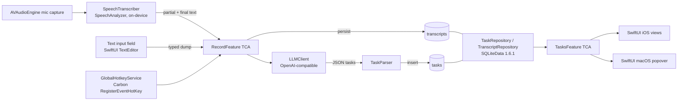

# Slush — Architecture (MVP)

> Living document. Captures the shape of the MVP; details will harden as code lands.

## High-level component diagram



## UX implications (load-bearing)
Slush is UX-driven (see PRD `Product principles`, `REQ-031`). The architecture below isn't just convenient — these choices exist specifically to keep the app feeling instant and out of the way. Treat them as requirements, not preferences.

- **Live partials stream into `RecordFeature.state.partialText`** so the user sees their words within hundreds of ms — product requirement, not a nicety (`REQ-031`).
- **`AVAudioEngine` starts synchronously on the user gesture.** Permission prompts are gated to first launch only, so the steady-state press → mic-active path is allocation-light (`REQ-031`).
- **LLM call is fire-and-forget from the user's perspective.** The transcript is persisted immediately; extraction runs in a background effect; `TasksFeature` re-renders via `@FetchAll` when rows land. The user is never staring at a spinner that owns the UI thread (`REQ-031`, `REQ-033`).
- **macOS hotkey path skips popover presentation.** Showing a popover would pay window-server latency on every capture; the hotkey starts recording without surfacing UI (`REQ-031`).
- **All repository, transcription, and LLM work is non-main-actor.** The main actor only formats view state and runs animations. 60 fps during recording is a hard target (`REQ-031`).
- **Typed input shares the LLM/repository pipeline (`REQ-025`).** No mic, no transcription, no permissions; the same `RecordFeature → LLMClient → TaskRepository → @FetchAll` path applies. The `REQ-031` budgets that don't depend on mic capture (tasks-visible after LLM ≤ 50 ms; UI never blocks) carry over to the typed path unchanged.

## Module breakdown

### `SlushKit` — Swift Package (shared)
- Domain models: `Task`, `Transcript`, `TaskDraft`, `Settings`.
- TCA reducers: `AppFeature`, `RecordFeature`, `TasksFeature`, `SettingsFeature`.
- Protocols: `SpeechTranscribing`, `LLMClient`, `TaskRepository`, `TranscriptRepository`, `KeychainStoring`, `SettingsStoring`.
- Implementations: `AppleSpeechTranscriber`, `OpenAICompatibleLLMClient`, `SQLiteDataTaskRepository`, `SQLiteDataTranscriptRepository`, `KeychainStore`, `UserDefaultsSettingsStore`.

### `SlushiOS` — iPhone app target
- SwiftUI app shell, root `AppView` hosting tab navigation: `RecordView`, `TasksView`, `SettingsView`.
- Mic + speech permission gating before first record.
- Depends on `SlushKit`.

### `SlushMac` — menubar app target
- `MenuBarExtra` host with popover containing `RecordView` (compact) + recent `TasksView`.
- Standalone `SettingsScene` window.
- `GlobalHotkeyService` registers the user's shortcut via `Carbon.HIToolbox` `RegisterEventHotKey`.
- Depends on `SlushKit`.

## TCA reducers (responsibilities)
- **`AppFeature`** — composes child features, wires `@Dependency` instances of repositories, transcriber, and LLM client.
- **`RecordFeature`** — owns the capture state machine (`idle`, `recording`, `transcribing`, `extracting`, `error`). Accepts text from two sources: live partials from `SpeechTranscribing` (voice path) and a bound text field (typed path, `REQ-025`). Persists final `Transcript`, calls `LLMClient.extractTasks`, hands drafts to the repository, surfaces errors with the transcript retained for retry.
- **`TasksFeature`** — observes open and recently completed tasks via `@FetchAll`; handles complete and delete actions.
- **`SettingsFeature`** — bindings for base URL, API key (round-tripped through `KeychainStoring`), model name, and (macOS only) the global hotkey combo.
- **`MenuBarFeature`** (macOS) — popover open/close, hotkey events, brings child `RecordFeature` and `TasksFeature` into scope.

## Data flow (step-by-step)
1. User taps the record button or fires the global hotkey → `RecordFeature` transitions `idle → recording` and starts `AVAudioEngine` mic capture.
2. PCM buffers stream into `SpeechTranscriber` (Apple `SpeechAnalyzer` + `SpeechTranscriber`) on-device. Partial results flow into `RecordFeature.state.partialText` and render live.
3. User stops → final transcript is committed; `RecordFeature` writes a `Transcript` row via `TranscriptRepository`.
4. `RecordFeature` transitions to `extracting` and calls `LLMClient.extractTasks(transcript:)`, which POSTs to `{baseURL}/chat/completions` with the structured-output schema.
5. The decoded `[TaskDraft]` is passed to `TaskRepository.insert(_:sourceTranscriptId:)`, which writes all rows in a single SQLiteData transaction.
6. `TasksFeature` re-renders automatically — its `@FetchAll` query observes the `tasks` table.
7. On LLM failure, `RecordFeature` enters `error`, keeping the transcript and offering a retry action; the transcript row is preserved so the user does not lose their dump.

**Typed-input path (`REQ-025`)**: steps 1–3 are skipped. The user types into a text field bound to `RecordFeature`; on submit, the entered text is committed directly as a `Transcript` row (`duration_seconds = 0` as a sentinel for "not recorded"), and the flow rejoins at step 4. Same persistence, same repository, same UI update path. Same failure semantics as voice (step 7).

## LLM integration
- **Endpoint**: `POST {baseURL}/chat/completions` with `Authorization: Bearer {apiKey}`.
- **Request body**:
  - `model` — from Settings.
  - `messages` — `[{role: "system", content: <extraction prompt>}, {role: "user", content: <transcript>}]`.
  - `response_format` — `{ type: "json_schema", json_schema: { name: "task_list", strict: true, schema: <task list schema> } }`. Falls back to `{ type: "json_object" }` if the server rejects `json_schema`.
- **Schema**:
  ```json
  {
    "type": "object",
    "properties": {
      "tasks": {
        "type": "array",
        "items": {
          "type": "object",
          "properties": {
            "title":  { "type": "string" },
            "detail": { "type": "string" }
          },
          "required": ["title"],
          "additionalProperties": false
        }
      }
    },
    "required": ["tasks"],
    "additionalProperties": false
  }
  ```
- **System prompt** (canonical text):
  > Extract distinct, atomic, actionable tasks from the user's spoken brain dump. Skip filler, hedges, and meta-commentary. Each task has a short imperative title and an optional one-line detail. Return JSON only.
- **Parsing**: `Codable` decode into `LLMTaskList { tasks: [LLMTaskDraft] }` → mapped to domain `TaskDraft`. Decode failure → `.error(.malformedResponse, transcript:)` so the UI can offer a retry.
- **Configuration gate**: extraction is disabled until base URL, API key, and model are set; the record button stays usable for capture-only flows but `RecordFeature` surfaces a "configure LLM in Settings" message instead of calling the network.

## SQLiteData schema
```sql
CREATE TABLE transcripts (
  id                TEXT     PRIMARY KEY,
  text              TEXT     NOT NULL,
  created_at        INTEGER  NOT NULL,
  duration_seconds  REAL     NOT NULL
);

CREATE TABLE tasks (
  id                    TEXT     PRIMARY KEY,
  title                 TEXT     NOT NULL,
  detail                TEXT,
  created_at            INTEGER  NOT NULL,
  completed_at          INTEGER,
  source_transcript_id  TEXT     REFERENCES transcripts(id) ON DELETE SET NULL
);

CREATE INDEX idx_tasks_open ON tasks(completed_at);
```
- `completed_at IS NULL` ⇒ open task. Boolean state derived, no separate flag.
- `source_transcript_id` enables debugging and future "show me what I said" surfaces; deletion of a transcript nulls the link rather than cascading.

## Key Apple frameworks (and why)
- **`Speech`** (`SpeechAnalyzer`, `SpeechTranscriber`) — modern on-device transcription introduced in iOS/macOS 26; matches deployment targets and keeps audio local.
- **`AVFoundation`** — mic capture (`AVAudioEngine`) and recording permission.
- **`SwiftUI`** — UI on both platforms; `MenuBarExtra` is the supported way to ship a SwiftUI menubar app.
- **`Carbon.HIToolbox`** (`RegisterEventHotKey`) — only public API for system-wide global hotkeys on macOS.
- **`Security`** (Keychain Services) — secure storage for the LLM API key.
- **`ComposableArchitecture`** (Point-Free) — state, effects, dependency injection across both targets.
- **`SQLiteData` 1.6.1** (Point-Free) — typed SQLite schema and observation that drives `@FetchAll`.

## Verification
- **Manual end-to-end (iOS)**: build `SlushiOS` in Xcode 26, run on iPhone simulator, grant mic + speech permissions, configure LLM in Settings, record a 20 s dump, confirm tasks appear and survive relaunch.
- **Manual end-to-end (macOS)**: build `SlushMac`, configure hotkey, fire hotkey from another foreground app, confirm recording starts without showing the popover and tasks are persisted.
- **Typed-input smoke (`REQ-025`)**: in either app, switch to the text input on the Record surface, type a short paragraph, submit, confirm tasks appear and persist across relaunch. Mic permissions should not be required for this path.
- **Unit tests in `SlushKit`**:
  - `OpenAICompatibleLLMClient` — golden-fixture decoding for both `json_schema` and `json_object` responses; malformed-response error path.
  - `SQLiteDataTaskRepository` — insert with transcript link, complete, delete, open-tasks query.
  - `RecordFeature` reducer — full state-machine transitions with mocked `SpeechTranscribing` and `LLMClient`; LLM-failure branch keeps transcript.
  - `SettingsFeature` reducer — Keychain round-trip via mock `KeychainStoring`.

## Known open questions
- Should the partial transcript be visible during recording, or only the finalized text on stop? (Working assumption: stream partials live, finalize on stop.)
- Recording length cap? (Working assumption: none for MVP; revisit if memory or transcription latency becomes an issue.)
- Default model when Settings is empty? (Working assumption: leave blank; `RecordFeature` refuses extraction until configured.)
